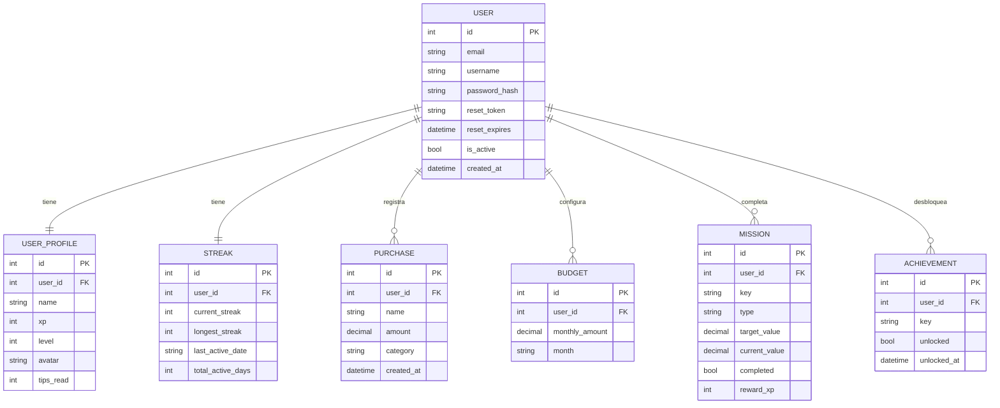

# MER Lógico — FINNY Finance App

> Modelo Entidad-Relación **lógico** — independiente del motor de base de datos.  
> Base de datos real utilizada: **MySQL 8.x**

---

## Entidades y Atributos

### USER
| Atributo | Tipo lógico | Restricción |
|---|---|---|
| **id** | Entero | PK, autoincremental |
| email | Texto | Único, no nulo |
| username | Texto | No nulo |
| password_hash | Texto | No nulo — almacena hash Werkzeug/PBKDF2-SHA256 |
| reset_token | Texto | Nulable |
| reset_expires | Fecha-Hora | Nulable |
| is_active | Booleano | Por defecto `true` |
| created_at | Fecha-Hora | Por defecto `NOW()` |

> [!IMPORTANT]
> El campo `password_hash` es de tipo **TEXT/VARCHAR**, nunca entero. La contraseña jamás se almacena en texto plano.

---

### PURCHASE
| Atributo | Tipo lógico | Restricción |
|---|---|---|
| **id** | Entero | PK, autoincremental |
| *user_id* | Entero | FK → USER |
| name | Texto | No nulo, máx. 100 caracteres |
| amount | Decimal | No nulo, > 0 |
| category | Texto | Por defecto `Other` |
| created_at | Fecha-Hora | Por defecto `NOW()` |

---

### BUDGET
| Atributo | Tipo lógico | Restricción |
|---|---|---|
| **id** | Entero | PK, autoincremental |
| *user_id* | Entero | FK → USER |
| monthly_amount | Decimal | Por defecto 0 |
| month | Texto | Formato YYYY-MM; único por user |
| created_at | Fecha-Hora | Por defecto `NOW()` |

---

### USER_PROFILE
| Atributo | Tipo lógico | Restricción |
|---|---|---|
| **id** | Entero | PK, autoincremental |
| *user_id* | Entero | FK → USER, único (1:1) |
| name | Texto | Por defecto `Joven` |
| xp | Entero | Por defecto 0 |
| level | Entero | Por defecto 1 |
| avatar | Texto | 2 letras, por defecto `JV` |
| tips_read | Entero | Por defecto 0 |
| created_at | Fecha-Hora | Por defecto `NOW()` |

---

### STREAK
| Atributo | Tipo lógico | Restricción |
|---|---|---|
| **id** | Entero | PK, autoincremental |
| *user_id* | Entero | FK → USER, único (1:1) |
| current_streak | Entero | Por defecto 0 |
| longest_streak | Entero | Por defecto 0 |
| last_active_date | Fecha | Nulable, formato YYYY-MM-DD |
| total_active_days | Entero | Por defecto 0 |

---

### MISSION
| Atributo | Tipo lógico | Restricción |
|---|---|---|
| **id** | Entero | PK, autoincremental |
| *user_id* | Entero | FK → USER |
| key | Texto | Único por usuario |
| title | Texto | No nulo |
| description | Texto | No nulo |
| icon | Texto | Emoji |
| type | Texto | Tipo de misión (`expense_count`, `streak`, etc.) |
| target_value | Decimal | Meta numérica |
| current_value | Decimal | Progreso actual |
| completed | Booleano | Por defecto `false` |
| reward_xp | Entero | XP a otorgar al completar |
| completed_at | Fecha-Hora | Nulable |

---

### ACHIEVEMENT
| Atributo | Tipo lógico | Restricción |
|---|---|---|
| **id** | Entero | PK, autoincremental |
| *user_id* | Entero | FK → USER |
| key | Texto | Único por usuario |
| title | Texto | No nulo |
| description | Texto | No nulo |
| icon | Texto | Emoji |
| unlocked | Booleano | Por defecto `false` |
| unlocked_at | Fecha-Hora | Nulable |

---

## Relaciones

---

## Cardinalidades

| Relación | Tipo |
|---|---|
| USER — USER_PROFILE | 1 : 1 obligatoria |
| USER — STREAK | 1 : 1 obligatoria |
| USER — PURCHASE | 1 : N (un usuario puede tener muchas compras) |
| USER — BUDGET | 1 : N (un presupuesto por mes) |
| USER — MISSION | 1 : N (set de misiones por usuario) |
| USER — ACHIEVEMENT | 1 : N (set de logros por usuario) |
